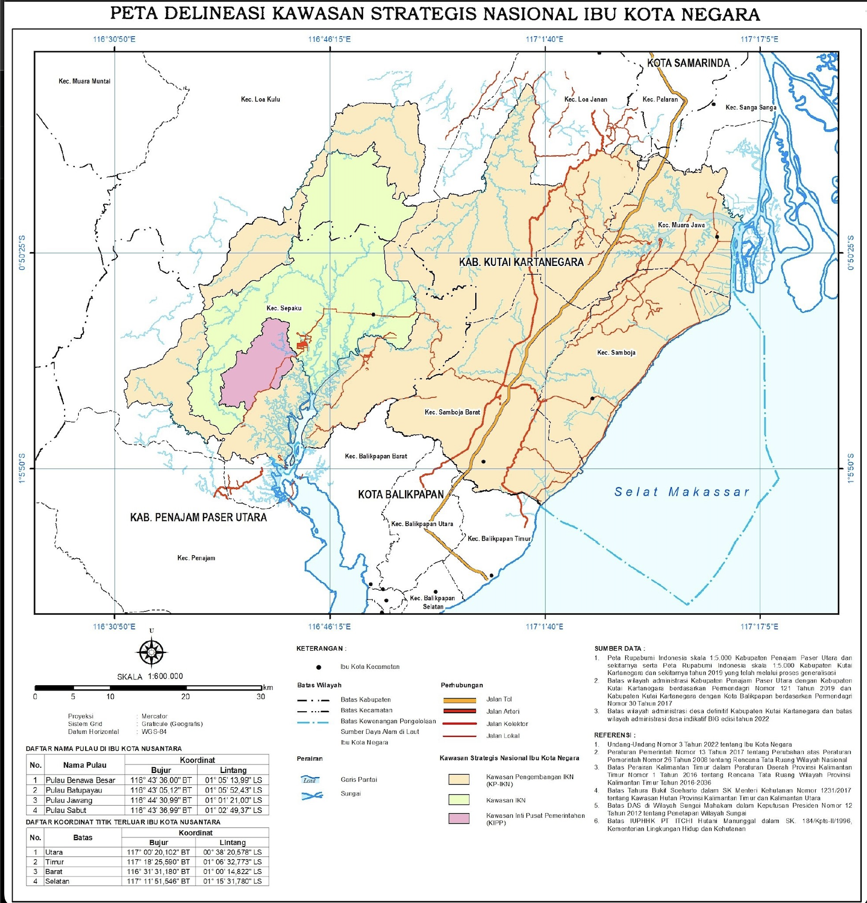

# Evaluating the Ecological Footprint of Nusantara: Impact Towards Key Biodiversity Regions Surrounding Indonesia's New Capital

## Abstract
This project evaluates the ecological impact of Nusantara's construction, Indonesia's new capital city, on surrounding key biodiversity regions. By leveraging satellite imagery and remote sensing techniques, the study examines vegetation health changes as a proxy for ecological welfare. Initial findings suggest that proximity to the construction site does not always correlate with declining vegetation health, providing new insights into environmental planning and policy-making.

---

## Background
The construction of Nusantara, initiated in 2022, aims to address Jakarta's overpopulation and land subsidence. However, concerns about the destruction of mangroves, rare species habitats, and other critical ecosystems have been raised. This project seeks to understand the ecological changes in key biodiversity regions through advanced geospatial analysis.

## Objectives
- Analyze vegetation health changes using NDVI (Normalized Difference Vegetation Index).
- Assess ecological welfare pre- and post-construction of Nusantara.
- Provide insights for policymakers on protecting biodiversity hotspots.

## Data Sources
1. **Hansen Global Forest Change v1.10**: Used for preliminary analysis of forest landscapes (2000–2022).
2. **Landsat 8 Collection 2 Tier 1 Level 2**: High-resolution satellite imagery with a spatial resolution of 30 meters.
3. **Official IKN Maps**: Administrative boundaries of Nusantara's construction.
4. **Verisk Maplecroft Maps**: Highlighting key biodiversity regions outside protected zones.

---
## Methodology

This study uses geospatial analysis to evaluate the ecological impact of Nusantara's construction. Two maps were georeferenced to define administrative and ecological study regions.

### Maps Used for Georeferencing

1. **Official IKN Map**  
   Provided by the Indonesian government, this map outlines the administrative regions of Nusantara. It was georeferenced in QGIS to delineate the city and construction zones.

   

2. **Verisk Maplecroft Map**  
   This map highlights key biodiversity regions surrounding Nusantara. Georeferencing enabled the creation of polygons representing critical ecological zones.

   

### Georeferencing Process

- Both maps were processed in QGIS using the GDAL extension for accurate spatial alignment.
- Control points were assigned by matching key geographic coordinates.
- Resulting polygons were exported to Google Earth Engine (API) for overlaying with NDVI data to assess vegetation health changes.

These georeferenced maps were foundational for analyzing the pre- and post-construction impact of Nusantara on surrounding ecosystems.

### NDVI Formula
The Normalized Difference Vegetation Index (NDVI) is calculated using the formula:

$$ NDVI = {(NIR - Red) \over (NIR + Red)} $$

Where:

- **NIR**: Near-infrared band (Band 5)  
- **Red**: Red band of the visible light spectrum (Band 4)

---

## NDVI Significant Gain and Loss Across Key Biodiversity Regions

The map above illustrates significant changes in vegetation health (NDVI) across key biodiversity regions surrounding the construction of Nusantara. Areas marked in **green** represent significant gains in vegetation health, while **red** areas indicate notable losses. The outlined regions denote protected key biodiversity areas, and the hatched red region represents the administrative boundaries of Nusantara's construction site.

### Insights:
Despite initial assumptions, the proximity to the construction site does not consistently predict vegetation loss. Notably, several biodiversity regions near the direct construction zone exhibited **significant gains** in vegetation health, potentially indicating effective local conservation efforts or natural regeneration processes. However, specific zones within the construction area experienced vegetation loss, attributed to deforestation and road construction activities. These findings challenge the simplistic assumption that proximity directly correlates with ecological degradation.

---

## NDVI Analysis Within the IKN Administrative Region

<table>
  <tr>
    <td></td>
    <td></td>
    <td></td>
  </tr>
  <tr>
    <td align="center">Pre-construction NDVI</td>
    <td align="center">Post-construction NDVI</td>
    <td align="center">NDVI Changes</td>
  </tr>
</table>

### Insights:
The three maps illustrate the vegetation health in the IKN administrative region across different periods:
- **Left (Pre-construction)**: NDVI values before the construction of Nusantara show widespread vegetation health, particularly in forested areas.
- **Center (Post-construction)**: The post-construction NDVI values reveal notable changes, with some areas showing reduced vegetation health, likely due to land clearing and road development.
- **Right (Changes)**: The difference map highlights areas of significant NDVI gain (green) and loss (red). While construction zones exhibit loss, some regions demonstrate unexpected vegetation health gains, suggesting localized regeneration or effective conservation practices.

These findings indicate that the ecological impact within the IKN administrative region is complex and not solely defined by proximity to construction sites. Further localized analyses are necessary to explain the patterns of vegetation gain and loss.

---
## Conclusion and Future Work

#### Conclusion
This study leverages NDVI analysis to assess vegetation health changes in Nusantara’s construction areas and surrounding biodiversity regions. While significant vegetation loss is observed near construction zones, some areas show vegetation gains, challenging assumptions about proximity-driven ecological degradation. These findings provide a baseline for informed policy-making in urban development and environmental conservation.

#### Future Work
- **Integrate Additional Variables**: Include other environmental indicators like water quality or carbon emissions to complement vegetation analysis.  
- **Extend Temporal Scope**: Continue monitoring NDVI trends to assess long-term ecological impacts of the ongoing construction.  
- **Refine Proximity Analysis**: Investigate additional factors influencing vegetation health to better understand non-linear ecological impacts.
